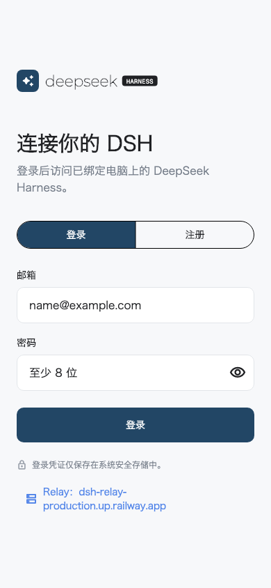
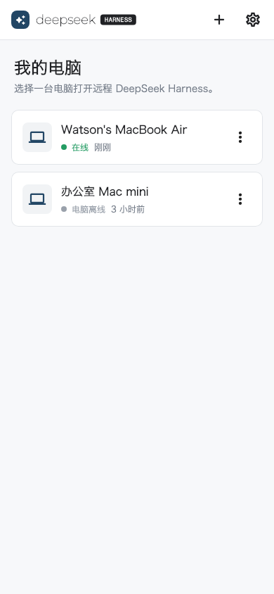

# DSH Remote Mobile

> **Community project:** this is an unofficial project, independently developed and maintained by the community. It is not reviewed, endorsed, or supported by DeepSeek.

Flutter mobile client for securely opening a computer's local DeepSeek Harness through the DSH Relay.

<table>
  <tr>
    <td></td>
    <td></td>
  </tr>
</table>

## Install the Android app

Download the signed `dsh-mobile-android.apk` from the [latest DSH Mobile Suite release](https://github.com/april-jk/dsh-mobile-suite/releases/latest). On Android, allow installation from the browser or file manager when prompted, then open **DSH Remote**.

The APK uses application ID `io.github.apriljk.dshremote`. Verify the downloaded file against `SHA256SUMS` from the same release before installing it.

## Requirements

- Flutter 3.38.10 (Dart 3.10)
- iOS 14 or newer
- Android 8.0 (API 26) or newer

## Run with the production Relay

The default build connects to the deployed HTTPS Relay:

```bash
flutter run
```

## Run with Mock Relay

Mock mode must be enabled explicitly and supports deterministic login, pairing, device management, and session states.

```bash
flutter run --dart-define=DSH_USE_MOCK=true
```

Use any valid email, a password with at least eight characters, and any six-digit pairing code.

## Prepare the computer

Install the `@april-jk/dsh-mobile` plugin into the DSH web profile, then start DSH:

```bash
dsh plugin --profile web add github:april-jk/dsh-mobile-plugin#v0.1.1
dsh web
```

The Companion follows the `dsh web` lifecycle. It does not need to be run as a separate background process.

## Pair and open DSH remotely

1. Open the mobile app and register or log in.
2. On the computer, open **Settings > Remote Access** in DSH and create a six-digit pairing code or QR code.
3. On the phone, tap **+**, scan the QR code or enter the six-digit code, then select the online computer.
4. The normal DSH Web UI opens inside the app. Create a task and submit instructions exactly as you would on the computer.

The computer keeps DSH on `127.0.0.1:3080`; the plugin makes only an outbound encrypted connection to the Relay.

## Run with a real Relay

```bash
flutter run \
  --dart-define=DSH_USE_MOCK=false \
  --dart-define=DSH_RELAY_URL=http://127.0.0.1:8787
```

For an Android emulator, use `http://10.0.2.2:8787`. Physical devices need an HTTPS Relay or a development hostname reachable from the device. Production builds must use HTTPS.

Public builds can connect to a private Relay without recompilation. Before login, tap the **Relay** server button, or open **Settings > Relay 服务器** after login, and enter the Relay's HTTPS origin. Start the computer with the matching origin, for example `DSH_RELAY=https://relay.example.com dsh web`. Changing Relay logs out the current account because tokens belong to the previous server.

## Verification

```bash
dart format --output=none --set-exit-if-changed lib test
flutter analyze
flutter test
flutter build apk --debug
flutter build ios --release --no-codesign
```

## Android release signing

The Android application ID is `io.github.apriljk.dshremote`. Release builds never fall back to the Android Debug certificate.

Copy `android/key.properties.example` to the ignored `android/key.properties` file and point it at the release keystore, or provide these environment variables in CI:

- `DSH_ANDROID_STORE_FILE`
- `DSH_ANDROID_STORE_PASSWORD`
- `DSH_ANDROID_KEY_ALIAS`
- `DSH_ANDROID_KEY_PASSWORD`

Then build the Play Store bundle:

```bash
flutter build appbundle --release
```

Keep the original keystore and passwords in durable secret storage. Android updates must be signed by the same key.

The canonical cross-team contracts are in `../dsh-公共文档/`.

## License

[MIT](LICENSE)
